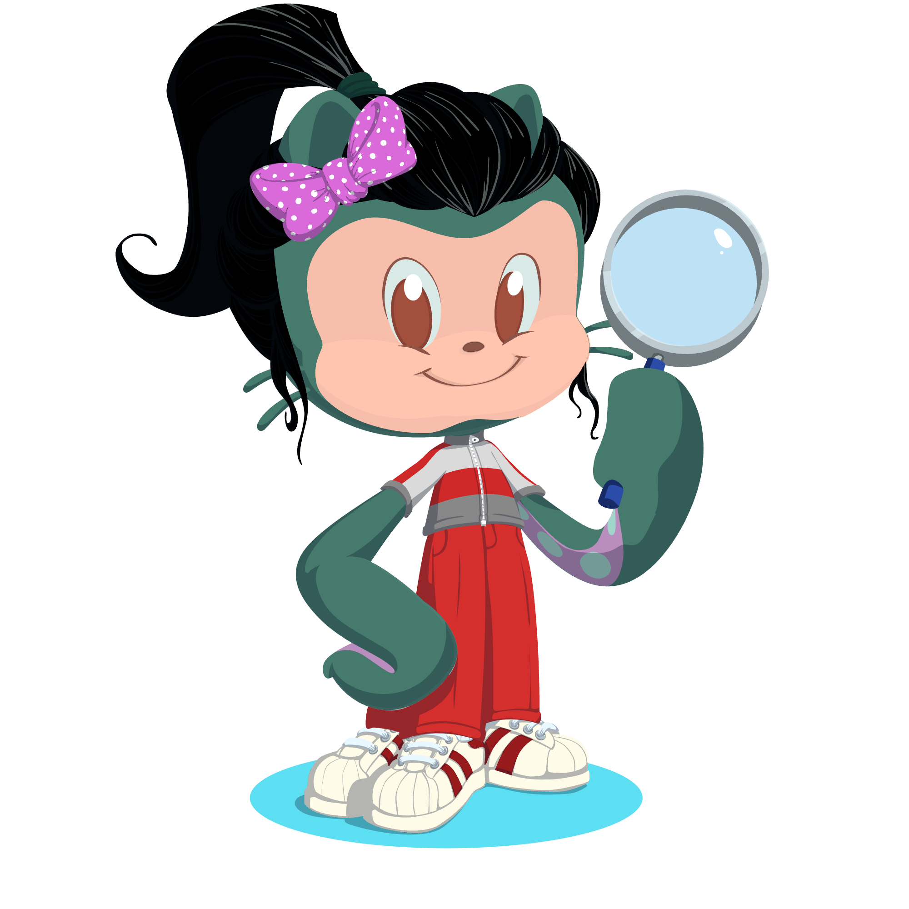

### Hi there 👋 I am Katja Kozjek, 

a bioinformatician at the National Bioinformatics Infrastructure Sweden (NBIS).

I support researchers in bioinformatics by performing data analyses and providing training.

Mainly, I focus on analyzing metagenomic and metatranscriptomic data from diverse environments, including soil, gut, and oral microbiomes

  

